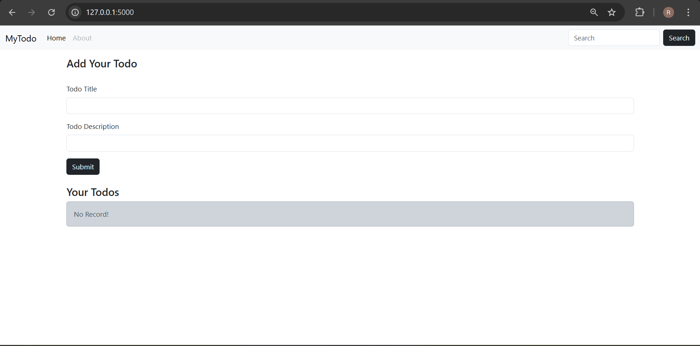
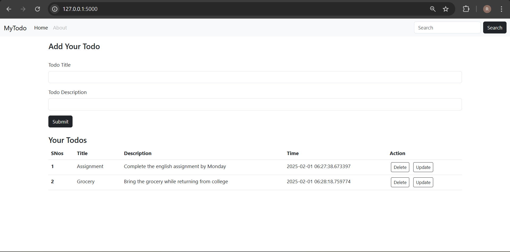

# To-Do List Web App

## Table of Contents
1. [Overview](#overview)
2. [Technologies Used](#technologies-used)
3. [Features](#features)
4. [Installation](#installation)
5. [Usage](#usage)
6. [App Structure](#app-structure)
6. [Screenshot for Reference](#screenshot-for-reference)

---

## Overview
This is a simple To-Do List web application built using Flask, Jinja, Python, and Bootstrap. It allows users to perform CRUD (Create, Read, Update, Delete) operations on tasks.

---

## Technologies Used
- **Flask**: A lightweight Python web framework for backend functionality.
- **Jinja**: Templating engine used to dynamically generate HTML pages.
- **Python**: Programming language used for backend logic.
- **Bootstrap**: Frontend framework used to style the app and make it responsive.
- **SQLAlchemy**: ORM (Object Relational Mapper) for interacting with a SQLite database to store the to-do tasks.

---

## Features
- **Create**: Add new to-do tasks with a title and description.
- **Read**: View a list of all to-do tasks.
- **Update**: Edit the title or description of existing to-do tasks.
- **Delete**: Remove tasks from the to-do list.

---

## Installation

1. Clone the repository:

    ```bash
    git clone <repository-url>
    cd <project-folder>
    ```

2. Create a virtual environment:

    ```bash
    python -m venv venv
    ```

3. Activate the virtual environment:
    - On Windows:

    ```bash
    venv\Scripts\activate
    ```

    - On Mac/Linux:

    ```bash
    source venv/bin/activate
    ```

4. Install dependencies:

    ```bash
    pip install -r requirements.txt
    ```

5. Create the database by running:

    ```bash
    python
    from app import db
    db.create_all()
    ```

---

## Usage

1. Run the Flask app:

    ```bash
    flask run
    ```

2. Visit the application in your browser at `http://127.0.0.1:5000`.

---

## App Structure

```
/to-do-list
    /instance
        - todo.db
    /templates
        - index.html
        - update.html
    /static
    app.py
    requirements.txt
```

- `app.py`: Main Flask application containing routes and logic.
- `templates/`: Contains the HTML templates, rendered by Jinja.
- `static/`: May contain static assets like CSS and JavaScript files.
- `requirements.txt`: List of project dependencies.

## Screenshot for Reference
 
 
